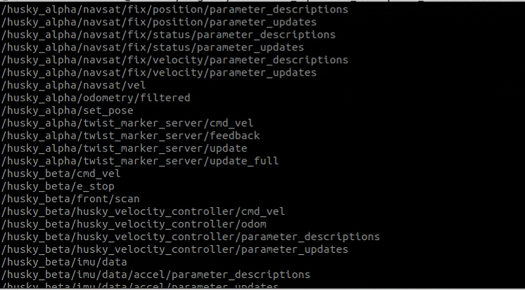

<!--
 * @Author: jia
 * @Date: 2023-03-27 23:01:16
 * @LastEditors: jia
 * @LastEditTime: 2023-03-30 15:12:00
 * @Description: 请填写简介
-->
Note: This is the open source code of CMU, and it is only suitable for our platform. Please find the original program on the official website.
目前我正在将其适配到Husky平台，并开发多机器人的仿真。


The repository is meant for leveraging system development and robot deployment for ground-based autonomous navigation and exploration. Containing a variety of simulation environments, autonomous navigation modules such as collision avoidance, terrain traversability analysis, waypoint following, etc, and a set of visualization tools, users can develop autonomous navigation systems and later on port those systems onto real robots for deployment.

Please use instructions on our [project page](https://www.cmu-exploration.com).

和原版的差别：
1. 修改了 /cmd_vel 话题的消息类型，方法是定义了一个接收话题的节点为 remapTwist 。
2. 修改了机器人的尺寸、速度，以及激光雷达传感器的位置，并重新根据需要运行了生成路径的 matlab 脚本。
3. 增加仿真和实车自动选择。
4. 加入Husky仿真环境，并实现多机器人仿真。

测试环境：
ubuntu 20.04 + ROS1 noetic

仿真方法：(需要有显示屏,因此仿真程序需要单独在自己的电脑中运行)
```shell
# 运行下面命令下载仿真环境，大概500MB
./src/vehicle_simulator/mesh/download_environments.sh
# 安装 usb 驱动
sudo apt install libusb-dev

source ./devel/setup.bash
roslaunch vehicle_simulator system_garage.launch
```
如果想仿真多个Husky机器人，采用以下方法修改源码：
```
1. set <arg name="multimaster" value="false"/> in multi_husky_playpen2.launch
2. modify spawn_husky.launch by adding argument <arg name="robot_namespace" value="$(arg robot_namespace)"/> under <include file="$(find husky_control)/launch/control.launch">
3. In control.launch, add the argument <arg name="robot_namespace" value="$(arg robot_namespace)"/> under <include file="$(find husky_description)/launch/description.launch" >
```
修改源码后，使用以下命令测试多机器人仿真环境：
```shell
source ./devel/setup.bash
roslaunch husky_gazebo multi_husky_playpen2.launch
```
最后可以得到如图所示的仿真环境：

得到的各个车的topic示例：

实车测试使用方法：

新开终端并输入以下命令：
```shell

# 新开终端
cd autonomous_exploration_development_environment
source ./devel/setup.bash
roslaunch vehicle_simulator system_real_robot.launch

# 此时桌面是没有输出的，需要新建终端另外打开 vehicle_simulator.rviz
#　在　vehicle_simulator.rviz　目录下运行如下命令：
rviz -d vehicle_simulator.rviz 
```

